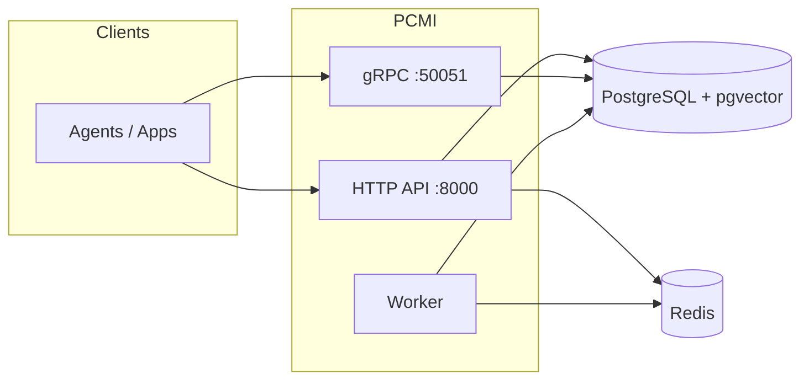
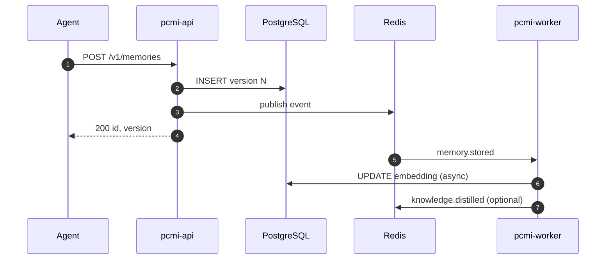

# PCMI — Persistent Cognitive Memory Infrastructure

[](https://github.com/marco-spagn/pcmi/actions/workflows/ci.yml)
[](https://github.com/marco-spagn/pcmi/actions/workflows/codeql.yml)
[](badges/coverage.json)
[](go.mod)
[](LICENSE)
[](internal/version/version.go)

**Durable, multi-tenant memory for AI agents** — outside the agent runtime, with HTTP and gRPC APIs, hybrid retrieval, background workers, and enterprise controls (RLS, RBAC, audit, observability).

Agents are ephemeral. Organizational memory should not be.

---

## Table of contents

- [Why PCMI](#why-pcmi)
- [Features](#features)
- [Quick start](#quick-start)
- [Usage examples](#usage-examples)
- [Architecture](#architecture)
- [APIs and clients](#apis-and-clients)
- [Documentation](#documentation)
- [Repository layout](#repository-layout)
- [Development](#development)
- [Contributing](#contributing)
- [Security](#security)
- [License](#license)

---

## Why PCMI

Production agents are replaced, upgraded, and sharded across teams. Without a shared memory layer:

- Knowledge stays trapped in prompts, vector indexes, or vendor-specific chat history.
- Deployments and model swaps force expensive re-ingestion.
- Auditors cannot answer *what the system knew at decision time*.

PCMI centralizes **versioned, path-scoped memories** in PostgreSQL, with optional embeddings, distillation, events, and webhooks — consumable from any agent framework or LLM provider.



---

## Features

| Area | Capabilities |
|------|----------------|
| **Memory** | Hierarchical `ltree` paths, append-only versioning, tags, TTL, optional field encryption |
| **Retrieve** | Path scope, BM25 full-text, optional semantic search, `as_of` temporal reads, keyset cursors |
| **Workers** | Embedding backfill, knowledge distillation, consolidation, pruning, compaction, expiry |
| **Integration** | Redis events, SSE, gRPC streams, webhooks + dead-letter queue |
| **Graph** | Memory links, lineage (raw + distilled knowledge) |
| **Security** | API-key RBAC, PostgreSQL RLS per tenant, audit log |
| **Ops** | Prometheus metrics, OpenTelemetry, Helm chart, health/readiness probes |
| **Admin** | Tenant/API-key management (HTTP + gRPC), embedded UI at `GET /v1/admin/ui` |

Current API version: see `version` on [`GET /v1/health`](docs/openapi.yaml) (source of truth: [`internal/version/version.go`](internal/version/version.go)).

---

## Quick start

**Requirements:** [Docker](https://docs.docker.com/get-docker/) and Docker Compose (recommended). For local Go development: **Go 1.25+**.

```bash
git clone https://github.com/marco-spagn/pcmi.git
cd pcmi
cp .env.example .env
docker compose up -d --build

curl -s http://localhost:8000/v1/health | jq .
```

After migrations, the dev seed API key is **`testkey123`** (admin role). See [`.env.example`](.env.example) for all configuration options.

| Service | Port | Purpose |
|---------|------|---------|
| HTTP API | `8000` | REST + SSE + admin UI |
| gRPC | `50051` | High-throughput memory + ops |
| PostgreSQL | `5432` | Primary store |
| Redis | `6379` | Events + worker coordination |

---

## Usage examples

### HTTP (curl)

```bash
export PCMI_BASE_URL=http://localhost:8000
export PCMI_API_KEY=testkey123

# Store
curl -s -X POST "$PCMI_BASE_URL/v1/memories" \
  -H "Content-Type: application/json" -H "X-API-Key: $PCMI_API_KEY" \
  -d '{"path":"root.demo.note","content":"Hello PCMI","tags":["demo"],"embedding_model":"unspecified"}'

# Retrieve
curl -s -X POST "$PCMI_BASE_URL/v1/retrieve" \
  -H "Content-Type: application/json" -H "X-API-Key: $PCMI_API_KEY" \
  -d '{"path_prefix":"root.demo","query":"","limit":10}'
```

### Python SDK

```bash
pip install -e sdk/python
```

```python
from pcmi import PCMIClient
import asyncio

async def main():
    async with PCMIClient("http://localhost:8000", "testkey123") as client:
        await client.store("root.agent.task", "completed step X", tags=["task"])
        result = await client.retrieve("root.agent", limit=5)
        print(result["total"])

asyncio.run(main())
```

### Real-time events (SSE)

```bash
curl -sN "$PCMI_BASE_URL/v1/events" \
  -H "X-API-Key: $PCMI_API_KEY" \
  -H "Accept: text/event-stream"
```

Full operational guide: **[docs/USAGE.md](docs/USAGE.md)** · SDK reference: **[sdk/README.md](sdk/README.md)**

---

## Architecture



Deeper design: **[docs/architecture.md](docs/architecture.md)** · Data model: **[docs/DATA-MODEL.md](docs/DATA-MODEL.md)** · Workers & events: **[docs/WORKERS-AND-EVENTS.md](docs/WORKERS-AND-EVENTS.md)**

---

## APIs and clients

| Surface | When to use |
|---------|-------------|
| **HTTP REST** | OpenAPI tooling, browsers, SSE, Prometheus scrape at `GET /metrics`, admin UI |
| **gRPC** | Agents, batch workloads, streaming retrieve/events; `MemoryService`, `AdminService`, `MetricsService` |
| **SDKs** | Python & TypeScript thin HTTP clients — see [sdk/HTTP-API.md](sdk/HTTP-API.md) |
| **MCP** | stdio server for Cursor / Claude — see [docs/MCP.md](docs/MCP.md) |

| Resource | Location |
|----------|----------|
| OpenAPI 3 | [docs/openapi.yaml](docs/openapi.yaml) |
| MCP server | [docs/MCP.md](docs/MCP.md) |
| gRPC protos | [proto/pcmi/v1/](proto/pcmi/v1/) |
| gRPC ↔ HTTP matrix | [docs/grpc-vs-http.md](docs/grpc-vs-http.md) |

**Note:** Official SDKs speak HTTP only. Use gRPC stubs for maximum throughput or streaming.

---

## Documentation

**Full index:** [docs/INDEX.md](docs/INDEX.md)

| Document | Description |
|----------|-------------|
| [docs/USAGE.md](docs/USAGE.md) | End-to-end usage (HTTP, gRPC, env, paths) |
| [docs/DATA-MODEL.md](docs/DATA-MODEL.md) | Schema, versioning, RLS |
| [docs/retrieval-pipeline.md](docs/retrieval-pipeline.md) | Hybrid retrieve pipeline |
| [docs/WORKERS-AND-EVENTS.md](docs/WORKERS-AND-EVENTS.md) | Background jobs, Redis, webhooks |
| [docs/CODEBASE.md](docs/CODEBASE.md) | Go package map for contributors |
| [docs/integration-testing.md](docs/integration-testing.md) | Integration test tags and SSE notes |
| [docs/local-ci.md](docs/local-ci.md) | Reproduce CI locally |
| [docs/distillation-tests.md](docs/distillation-tests.md) | Distillation E2E harness |
| [deploy/helm/README.md](deploy/helm/README.md) | Kubernetes / Helm deployment |
| [CHANGELOG.md](CHANGELOG.md) | Release history |

Optional technical report (PDF build): [docs/papers/](docs/papers/).

---

## Repository layout

| Path | Description |
|------|-------------|
| [`cmd/api`](cmd/api) | HTTP + gRPC server, `/metrics`, admin UI |
| [`cmd/mcp`](cmd/mcp) | MCP stdio server for AI agents (`pcmi-mcp`) |
| [`cmd/worker`](cmd/worker) | Embedding, distillation, pruning, expiry |
| [`internal/`](internal/) | Domain logic (handler, service, repository, worker, grpc) |
| [`proto/`](proto/) | Protobuf definitions |
| [`migrations/`](migrations/) | SQL schema (`001`–`012`) |
| [`sdk/`](sdk/) | Python & TypeScript HTTP clients |
| [`examples/`](examples/) | Celery & Temporal integration samples |
| [`deploy/helm/`](deploy/helm/) | Primary Kubernetes packaging |
| [`deploy/k8s/`](deploy/k8s/) | Static manifests (non-Helm) |
| [`k8s/`](k8s/) | **Deprecated** — use `deploy/helm/` |
| [`scripts/`](scripts/) | CI smoke, distillation E2E, coverage |
| [`.github/workflows/`](.github/workflows/) | CI, CodeQL |

Container images: `Dockerfile.api`, `Dockerfile.worker` (root `Dockerfile` is legacy).

---

## Development

```bash
# Unit tests
make test

# Lint (golangci-lint v2)
make lint

# gRPC integration: in-process (bufconn) or live TCP on :50051
make test-integration-bufconn   # Postgres only
make infra-up && make test-integration-live   # full stack + dial :50051
make test-integration           # both

# SDK smoke (Python + TypeScript)
make sdk-smoke

# Near-full CI parity locally (~15–25 min first run)
make test-all-local
# Faster: make test-all-local-quick

# Synthetic data (JSONL only, any preset)
make synth-list
make synth-generate PRESET=finance SYNTH_NUM=500 SYNTH_SEED=42

# Distillation end-to-end (requires OPENAI_API_KEY in .env)
make distillation-e2e
make distillation-e2e PRESET=advertising SYNTH_NUM=200 SYNTH_SEED=1
```

**CI on GitHub:** workflows run when the commit message contains `CI_start`, or via `gh workflow run CI`. The `go` job runs integration tests against Postgres only (live gRPC skipped); **`integration-smoke`** starts the API and runs gRPC on `:50051`. See [CONTRIBUTING.md](CONTRIBUTING.md) and [docs/local-ci.md](docs/local-ci.md).

**Coverage:** the badge reads [`badges/coverage.json`](badges/coverage.json) on `main`. CI enforces a minimum total in [`.github/workflows/ci.yml`](.github/workflows/ci.yml) (`COVERAGE_MIN_TOTAL`, currently **39%**). Local `make cover-check` defaults to a lower threshold for fast iteration.

---

## Contributing

We welcome issues and pull requests. Please read **[CONTRIBUTING.md](CONTRIBUTING.md)** before opening a PR (setup, tests, versioning, migrations, proto conventions).

---

## Security

Report vulnerabilities **privately** — do not open public issues for security bugs. See **[SECURITY.md](SECURITY.md)** for disclosure process and SLAs.

---

## License

[Apache License 2.0](LICENSE) — Copyright 2026 Marco Spagnuolo & PCMI Team.
