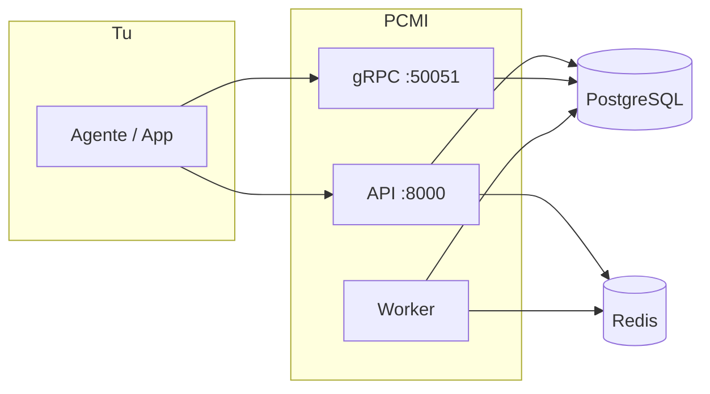
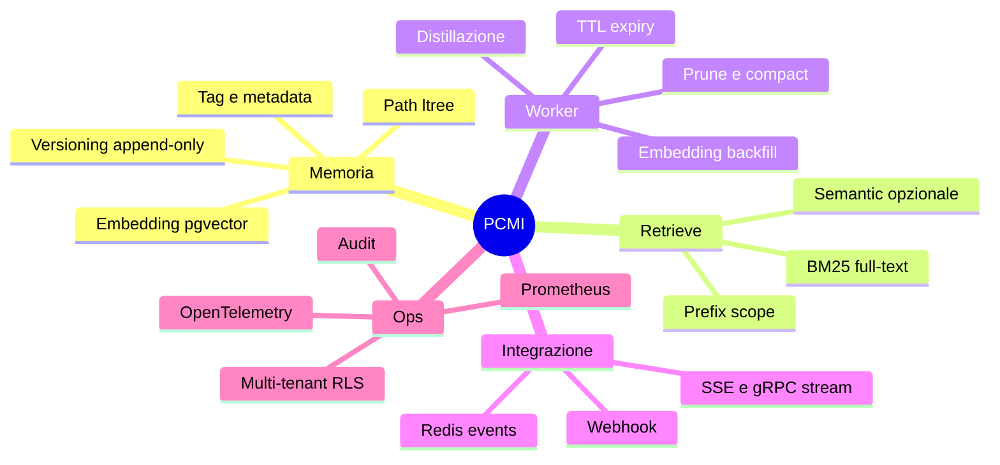
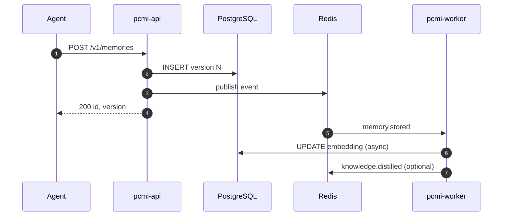

# PCMI – Persistent Cognitive Memory Infrastructure

La memoria vive **fuori** dagli agenti. Gli agenti sono effimeri; questo strato è persistente, indipendente dal runtime e raggiungibile via **HTTP** e **gRPC**.



---

## Come usare PCMI

### 1. Avvio rapido (Docker)

```bash
git clone https://github.com/marco-spagn/pcmi.git && cd pcmi
cp .env.example .env
docker compose up -d --build

# Verifica
curl -s http://localhost:8000/v1/health
```

Chiave di sviluppo (migration `003`): **`testkey123`** (ruolo `admin`).

### 2. Scrivere e leggere memorie (HTTP)

```bash
export PCMI_BASE_URL=http://localhost:8000
export PCMI_API_KEY=testkey123

# Store
curl -s -X POST "$PCMI_BASE_URL/v1/memories" \
  -H "Content-Type: application/json" -H "X-API-Key: $PCMI_API_KEY" \
  -d '{"path":"root.demo.note","content":"Hello PCMI","tags":["demo"],"embedding_model":"unspecified"}'

# Retrieve
curl -s -X POST "$PCMI_BASE_URL/v1/retrieve" \
  -H "Content-Type: application/json" -H "X-API-Key: $PCMI_API_KEY" \
  -d '{"path_prefix":"root.demo","query":"","limit":10}'
```

### 3. SDK (consigliato per agenti)

| Linguaggio | Setup | Smoke test |
|------------|-------|------------|
| **Python** | `pip install -e sdk/python` | `python sdk/python/smoke.py` |
| **TypeScript** | `cd sdk/typescript && npm ci && npm run smoke` | vedi [sdk/README.md](sdk/README.md) |

```python
# Python — esempio minimo
from pcmi import PCMIClient
import asyncio

async def main():
    async with PCMIClient("http://localhost:8000", "testkey123") as c:
        await c.store("root.agent.task", "fatto X", tags=["task"])
        print((await c.retrieve("root.agent", limit=5))["total"])

asyncio.run(main())
```

### 4. gRPC (alto throughput / streaming)

- Porta **50051** (`GRPC_PORT`)
- Proto: [`proto/pcmi/v1/memory.proto`](proto/pcmi/v1/memory.proto)
- Tabella RPC ↔ REST: [docs/grpc-vs-http.md](docs/grpc-vs-http.md)

```bash
make test-integration   # API+gRPC+Postgres attivi
```

### 5. Eventi in tempo reale

| Trasporto | Endpoint / RPC |
|-----------|----------------|
| HTTP SSE | `GET /v1/events` |
| gRPC stream | `StreamEvents` |

```bash
curl -sN http://localhost:8000/v1/events -H "X-API-Key: testkey123" -H "Accept: text/event-stream"
```

### 6. Comandi Makefile

```bash
make test              # unit test Go
make lint              # golangci-lint
make test-integration  # gRPC integration (stack up)
make sdk-smoke         # smoke Python + TypeScript
```

Guida completa: **[docs/USAGE.md](docs/USAGE.md)**

---

## Cosa fa PCMI



### Funzionalità principali

| Area | Capacità |
|------|----------|
| **Core** | Store/retrieve, batch, export/import, get by path, history, rollback |
| **Retrieve** | `tags`, `tags_match`, `as_of`, `source_agent_id`, `embedding_space`, hybrid BM25 + vector |
| **gRPC** | Parità con REST su memory + operational (refine, links, stats, webhooks, eventi, …) |
| **Worker** | Embedding, distillation, consolidation, pruning, expiry |
| **Eventi** | Ingest universale, schema registry, SSE, webhook + dead-letter |
| **Grafo** | Links tra path, lineage memoria/distillata |
| **Sicurezza** | API key RBAC, RLS tenant, cifratura opzionale, audit log |
| **Solo HTTP** | Admin tenants/keys, `GET /metrics` Prometheus |

Versione API corrente: risposta `version` su `/v1/health` (es. `v1.30.0`).

---

## Documentazione

**Indice completo:** [docs/INDEX.md](docs/INDEX.md)

| Documento | Contenuto |
|-----------|-----------|
| [docs/USAGE.md](docs/USAGE.md) | **Guida operativa** — HTTP, gRPC, SDK, env, path |
| [docs/architecture.md](docs/architecture.md) | Architettura e diagrammi |
| [docs/DATA-MODEL.md](docs/DATA-MODEL.md) | Schema, versioning, RLS |
| [docs/WORKERS-AND-EVENTS.md](docs/WORKERS-AND-EVENTS.md) | Worker, Redis, webhook |
| [docs/grpc-vs-http.md](docs/grpc-vs-http.md) | Matrice gRPC ↔ HTTP |
| [docs/openapi.yaml](docs/openapi.yaml) | OpenAPI REST |
| [docs/retrieval-pipeline.md](docs/retrieval-pipeline.md) | Pipeline di retrieve |
| [docs/CODEBASE.md](docs/CODEBASE.md) | Mappa codice Go |
| [sdk/README.md](sdk/README.md) | Client Python/TypeScript |

Diagrammi SVG storici: `docs/*.svg` (architettura, distillazione, versioning).

---

## Architettura logica



---

## Layout repository

| Path | Descrizione |
|------|-------------|
| `cmd/api` | Server HTTP + gRPC + `/metrics` |
| `cmd/worker` | Processi background |
| `internal/` | Dominio Go (handler, service, repository) |
| `proto/` | Protobuf gRPC |
| `migrations/` | Schema SQL |
| `sdk/` | Client HTTP |
| `examples/` | Celery, Temporal |
| `deploy/k8s/` | Manifest Kubernetes |
| `scripts/` | Smoke CI |

---

## Requisiti e licenza

- Go 1.22+ per build da sorgente
- Docker per stack completo
- Opzionale: `OPENAI_API_KEY` per embedding/semantic/LLM summarize

Vedi [LICENSE](LICENSE).
