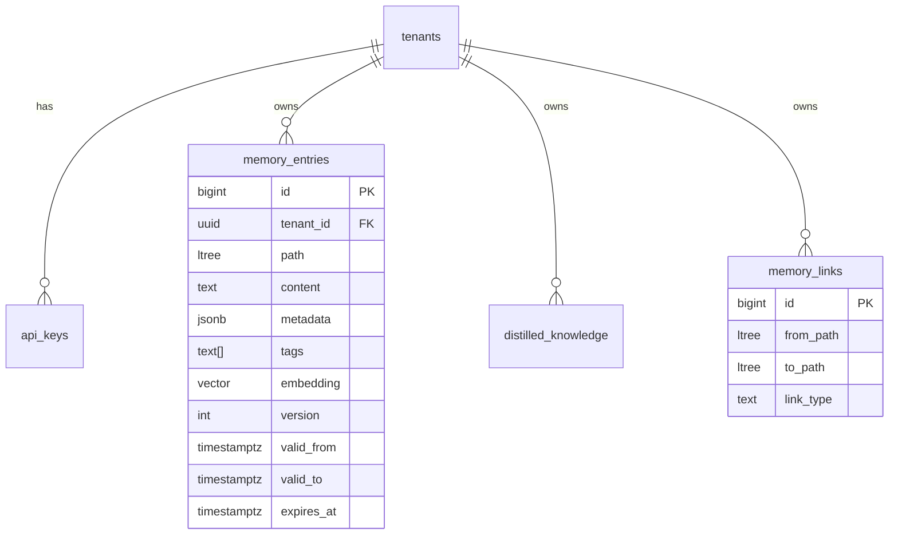
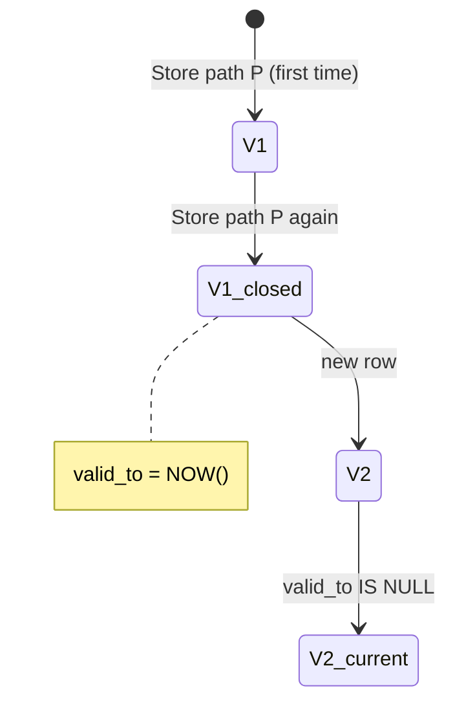
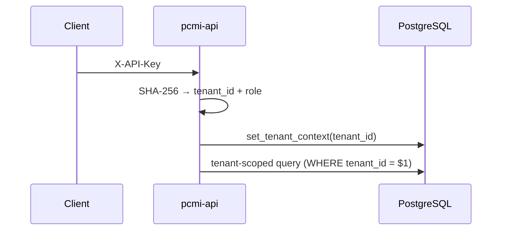

# PCMI Data Model

Logical schema for memories, versions, tenants, and graph.

## Main entities



## Append-only versioning



- **No UPDATE** on historical content: every store creates a new row.
- **Current version**: `valid_to IS NULL`.
- **Retrieve with `as_of`**: temporal slice (not just current).
- **Rollback**: new row that restores historical content.

## Hierarchical paths (`ltree`)

Examples:

| Path | Meaning |
|------|---------|
| `root` | Tenant root |
| `root.acme` | Project namespace |
| `root.acme.sprint42.notes` | Sprint notes |

`path_prefix` in retrieve = operator `<@` (descendant or equal).

## Embedding

| Field | Role |
|-------|------|
| `embedding` | `vector(1536)` — pgvector |
| `embedding_model` | Model label (e.g. `text-embedding-3-small`) |
| `embedding_space` | Logical space for multi-model migrations |

Store can send a client vector (REST `embedding`, gRPC `repeated float embedding`) or leave `NULL` for worker backfill.

## Multi-tenant security



### Tenant isolation

Isolation is enforced in **two layers**:

1. **Application query scoping (primary, always on).** Every query includes an
   explicit `tenant_id = $1` predicate resolved from the API key. This is the
   mechanism that actually isolates tenants in the default deployment.
2. **PostgreSQL Row-Level Security (defense-in-depth, opt-in).** RLS policies are
   defined and `ENABLE`d on `memory_entries`, `api_keys`, `idempotency_cache`,
   webhooks, etc., keyed on `set_tenant_context()` → `current_setting('app.current_tenant')`.

> **⚠️ RLS is not enforced in the default single-role setup.** PostgreSQL
> **bypasses RLS for a table's owner** unless the table is also marked
> `FORCE ROW LEVEL SECURITY`. In the shipped Docker/Compose configuration the
> application connects as `pcmi`, which is also the role that created (owns) the
> tables, and no table uses `FORCE`. The RLS policies therefore do **not** filter
> rows for the application — tenant isolation rests entirely on layer 1.

**To make RLS actively enforce** (recommended for regulated / multi-tenant SaaS):

1. Create a dedicated, non-owner application role and grant it only DML:
   ```sql
   CREATE ROLE pcmi_app LOGIN PASSWORD '…';
   GRANT SELECT, INSERT, UPDATE, DELETE ON ALL TABLES IN SCHEMA public TO pcmi_app;
   GRANT USAGE, SELECT ON ALL SEQUENCES IN SCHEMA public TO pcmi_app;
   ```
2. Force RLS on every tenant-scoped table, e.g.:
   ```sql
   ALTER TABLE memory_entries FORCE ROW LEVEL SECURITY;
   -- repeat for api_keys, idempotency_cache, webhook_endpoints, … (all RLS tables)
   ```
3. Point `DATABASE_URL` at `pcmi_app` (not the owner).
4. Ensure `set_tenant_context()` runs **on the same connection, inside the same
   transaction** as the queries it protects. The default pgxpool usage acquires a
   connection per statement and `set_tenant_context` uses session scope
   (`set_config(..., false)`), so under `FORCE` you must pin the connection (or
   wrap each request in a transaction) or queries will see an unset/stale
   `app.current_tenant`. Several policies read `current_setting('app.current_tenant')`
   without the `missing_ok` flag and will error if the setting is unset.

Until those steps are taken, treat RLS as latent defense-in-depth, not the
active isolation boundary.

## Related tables

| Table | Use |
|-------|-----|
| `memory_entries` | Versioned memories |
| `distilled_knowledge` | Distilled summaries |
| `memory_links` | Typed edges between paths (`link_type` set by the client on create — see [cognitive-graph.md § How data enters PCMI](cognitive-graph.md#how-data-enters-pcmi--who-classifies-what)) |
| `webhook_endpoints` / `webhook_deliveries` | HTTP notifications |
| `audit_log` | API request audit |

SQL: `migrations/` directory — order in [MIGRATIONS.md](MIGRATIONS.md).
