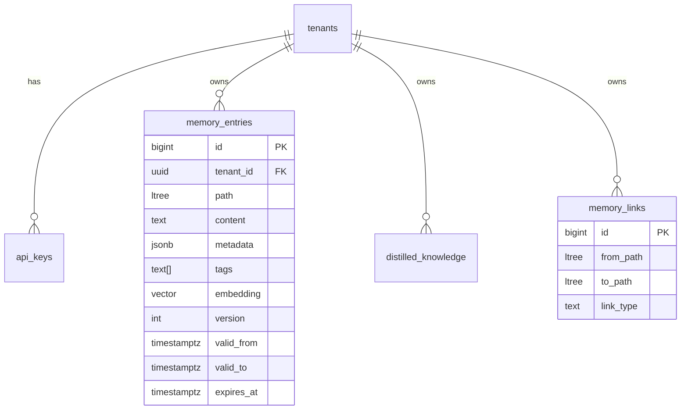
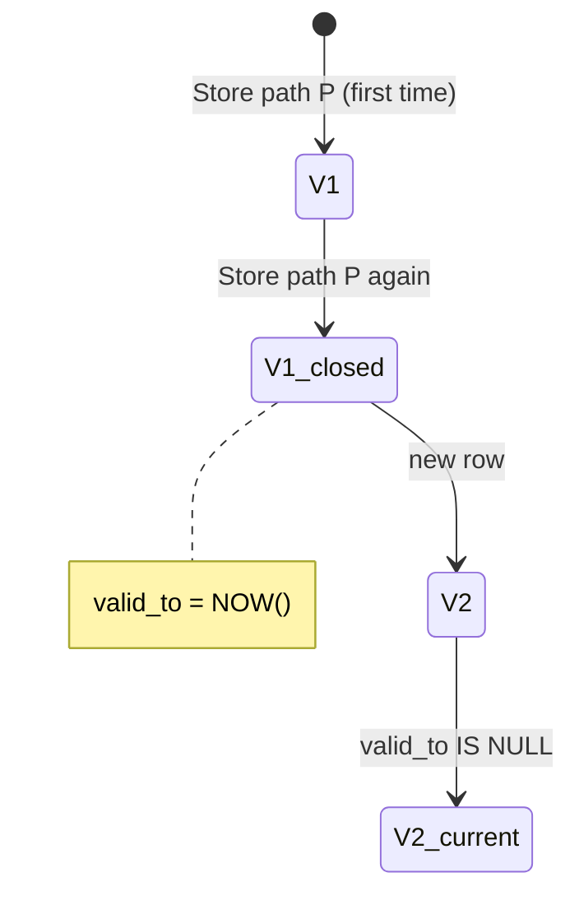
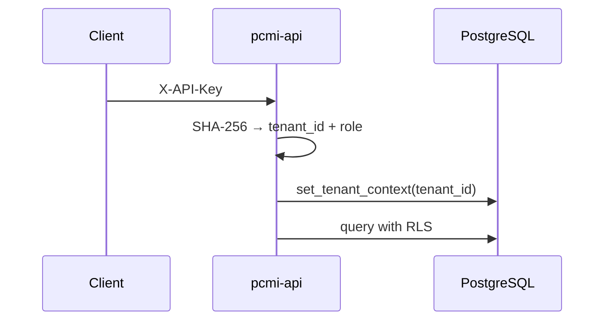

# PCMI Data Model

Logical schema for memories, versions, tenants, and graph.

## Main entities

## Append-only versioning

- **No UPDATE** on historical content: every store creates a new row.
- **Current version**: `valid_to IS NULL`.
- **Retrieve with `as_of`**: temporal slice (not just current).
- **Rollback**: new row that restores historical content.

## Hierarchical paths (`ltree`)

Examples:

| Path | Meaning |
|------|---------|
| `root` | Tenant root |
| `root.acme` | Project namespace |
| `root.acme.sprint42.notes` | Sprint notes |

`path_prefix` in retrieve = operator `<@` (descendant or equal).

## Embedding

| Field | Role |
|-------|------|
| `embedding` | `vector(1536)` — pgvector |
| `embedding_model` | Model label (e.g. `text-embedding-3-small`) |
| `embedding_space` | Logical space for multi-model migrations |

Store can send a client vector (REST `embedding`, gRPC `repeated float embedding`) or leave `NULL` for worker backfill.

## Multi-tenant security

RLS on `memory_entries`, `api_keys`, webhooks, etc.

## Related tables

| Table | Use |
|-------|-----|
| `memory_entries` | Versioned memories |
| `distilled_knowledge` | Distilled summaries |
| `memory_links` | Typed edges between paths (`link_type` set by the client on create — see [cognitive-graph.md § How data enters PCMI](cognitive-graph.md#how-data-enters-pcmi--who-classifies-what)) |
| `webhook_endpoints` / `webhook_deliveries` | HTTP notifications |
| `audit_log` | API request audit |

SQL: `migrations/` directory — order in [MIGRATIONS.md](MIGRATIONS.md).
