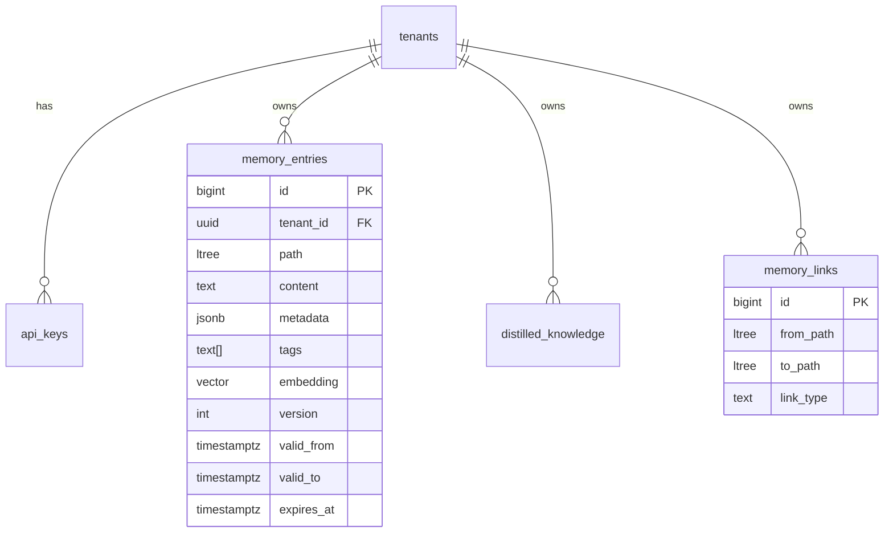

# Modello dati PCMI

Schema logico per memorie, versioni, tenant e grafo.

## Entità principali

## Versioning append-only

- **Nessun UPDATE** sul contenuto storico: ogni store crea una nuova riga.
- **Versione corrente**: `valid_to IS NULL`.
- **Retrieve con `as_of`**: slice temporale (non solo corrente).
- **Rollback**: nuova riga che ripristina contenuto storico.

## Path gerarchici (`ltree`)

Esempi:

| Path | Significato |
|------|-------------|
| `root` | Radice tenant |
| `root.acme` | Namespace progetto |
| `root.acme.sprint42.notes` | Note sprint |

`path_prefix` in retrieve = operatore `<@` (discendente o uguale).

## Embedding

| Campo | Ruolo |
|-------|--------|
| `embedding` | `vector(1536)` — pgvector |
| `embedding_model` | Etichetta modello (es. `text-embedding-3-small`) |
| `embedding_space` | Spazio logico per migrazioni multi-modello |

Store può inviare vettore client (REST `embedding`, gRPC `repeated float embedding`) oppure lasciare `NULL` per backfill worker.

## Sicurezza multi-tenant

RLS su `memory_entries`, `api_keys`, webhook, ecc.

## Tabelle correlate

| Tabella | Uso |
|---------|-----|
| `memory_entries` | Memorie versionate |
| `distilled_knowledge` | Sintesi distillate |
| `memory_links` | Grafo tra path |
| `webhook_endpoints` / `webhook_deliveries` | Notifiche HTTP |
| `audit_log` | Audit richieste API |

SQL: cartella `migrations/` — ordine in [MIGRATIONS.md](MIGRATIONS.md).
