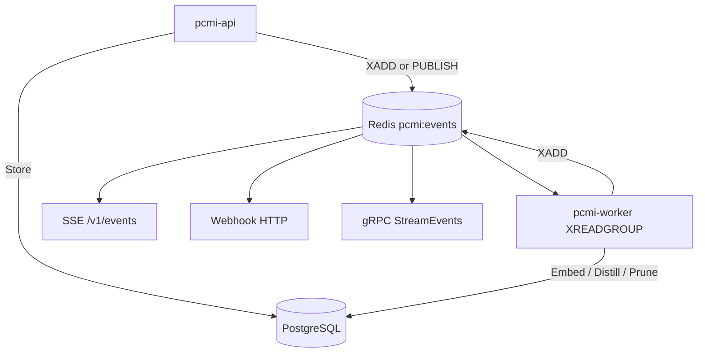
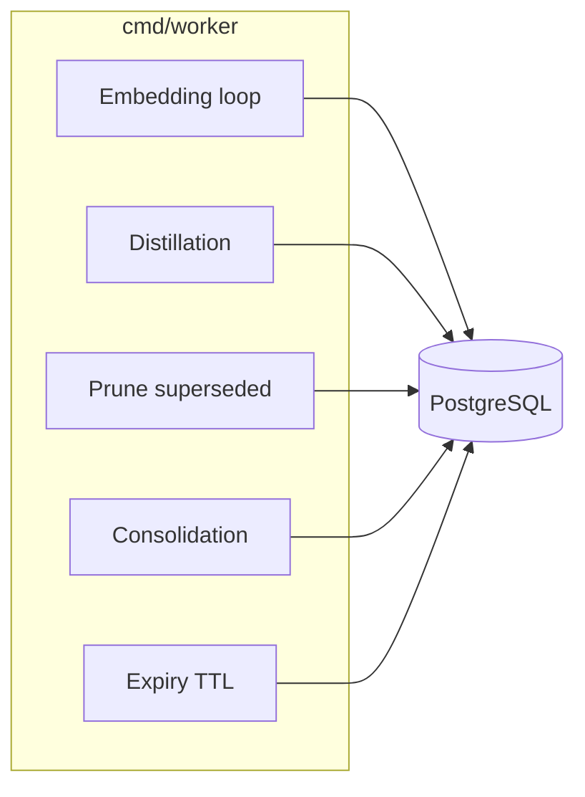

# Workers and events

How PCMI processes memories in the background and notifies clients.

## Event architecture

Configurable Redis transport via **`EVENT_BACKEND`** (default **`streams`**):

| Value | Mechanism | Notes |
|-------|-----------|-------|
| `streams` | `XADD` on stream **`pcmi:events`**, consumer group **`pcmi-workers`** | Durable, at-least-once; DLQ `pcmi:events:dlq` after max attempts |
| `pubsub` | Legacy channel **`memory_events`** | Backward compatibility for existing installations |

API and worker must use the **same** backend. Test Streams bus without Docker: `make test-streams-integration`.



## Event types (Redis / SSE)

| Type | When |
|------|------|
| `memory.stored` | First version of a path |
| `memory.updated` | New version (supersedes) |
| `memory.refine.requested` | `POST /v1/memories/refine` or gRPC `Refine` |
| `knowledge.distilled` | Worker produced a distillation |

Payload schema: `GET /v1/events/schemas` or gRPC `ListEventSchemas`.

## Worker jobs



| Loop | Env / trigger | Effect |
|------|---------------|--------|
| Embedding | `OPENAI_API_KEY`, `list_pending_embeddings` | Fills NULL `embedding`; **circuit breaker** on OpenAI provider |
| Distillation | `LLM_PROVIDER` + API key, Redis events, refine | `distilled_knowledge` — see [Changing LLM provider](#changing-llm-provider) |
| Pruning | `PRUNE_INTERVAL_SECS` | Removes old closed versions |
| Consolidation | events / threshold | Path `.consolidated` |
| Expiry | `EXPIRY_INTERVAL_SECS` | Closes rows with past `expires_at` |

Worker metrics: `GET :8081/metrics` (`pcmi_worker_redis_events_total`).

### Changing LLM provider

The distillation worker supports four providers selectable via `LLM_PROVIDER` without code changes. The default is `openai` for compatibility with existing installations.

| `LLM_PROVIDER` | Alias | Endpoint | API Key | Default model |
|---|---|---|---|---|
| `openai` | — | api.openai.com | `OPENAI_API_KEY` | `gpt-4o-mini` |
| `grok` | `xai` | api.x.ai/v1 | `GROK_API_KEY` | `grok-3-mini` |
| `anthropic` | `claude` | api.anthropic.com/v1/messages | `ANTHROPIC_API_KEY` | `claude-haiku-4-5-20251001` |
| `deepseek` | — | api.deepseek.com/v1 | `DEEPSEEK_API_KEY` | `deepseek-chat` |

`DISTILLATION_MODEL` overrides the default model for any provider.

**Example — switch to Claude:**

```env
LLM_PROVIDER=anthropic
ANTHROPIC_API_KEY=ant-...
# optional: force a specific model
DISTILLATION_MODEL=claude-opus-4-7
```

**Example — Grok:**

```env
LLM_PROVIDER=grok
GROK_API_KEY=xai-...
```

**Example — DeepSeek:**

```env
LLM_PROVIDER=deepseek
DEEPSEEK_API_KEY=...
```

If the provider is valid but the API key is missing, the worker logs a warning and skips LLM distillation (same semantics as the previous behavior with empty `OPENAI_API_KEY`). If `LLM_PROVIDER` contains an unsupported value, the worker logs the error and falls back to an unconfigured OpenAI client.

> **Anthropic note:** the API format differs from OpenAI — the `system` prompt is a top-level field, not an array message. The adapter in `internal/worker/llm_anthropic.go` handles the translation transparently. No additional SDK dependency is required.

### Embedding circuit breaker (Sprint 1)

All providers from `internal/embedding/factory` are wrapped with **`CircuitBreakerProvider`** (gobreaker + outbound rate limit). If the circuit is **open**, the worker skips embedding without blocking the loop (fast-fail).

| Metric | Meaning |
|--------|---------|
| `pcmi_embedding_circuit_state{state="open\|half_open\|closed"}` | Current state (one at 1) |
| `pcmi_embedding_requests_total{result="success\|error\|circuit_open"}` | Call outcomes |

Test: `make test-circuit-breaker`.

## Webhook

1. `POST /v1/webhooks` registers URL + `event_types` (+ optional `secret`).
2. API dispatcher sends HTTP POST on Redis match.
3. Failures → retry → `GET /v1/webhooks/dead-letter`.

gRPC: `RegisterWebhook`, `ListWebhooks`, `ListWebhookDeadLetter`.

### SSRF egress filter

Webhook targets must be `http(s)` and resolve to a public address. Registration
and delivery both reject private, loopback, link-local (incl. the
`169.254.169.254` cloud-metadata endpoint), and unique-local addresses — the
dial-time check also stops DNS rebinding and redirects to internal hosts. To
allow trusted internal receivers (e.g. a collector on your private network), set
`WEBHOOK_ALLOW_PRIVATE_TARGETS=true`.

### HMAC-SHA256 signature (v1.39+)

Every delivery includes:

| Header | Value |
|--------|-------|
| `X-PCMI-Signature` | `sha256={hex(HMAC-SHA256(secret, timestamp + "." + body))}` |
| `X-PCMI-Timestamp` | Unix epoch (seconds, decimal string) |
| `X-PCMI-Delivery-ID` | UUID of the `webhook_deliveries` row |
| `X-PCMI-Event-Delivery` | `1` |
| `Content-Type` | `application/json` |

Consumer-side verification (default 5-minute tolerance):

- Go: `crypto.HMACVerify(secret, signature, timestamp, body, time.Now(), crypto.DefaultWebhookMaxAge)`
- Python: `pcmi.webhook.verify_signature(secret, signature, timestamp, body)`
- TypeScript: `verifySignature(secret, signature, timestamp, body)` from `sdk/typescript/src/webhook.ts`

## Consuming events

| Mode | How |
|------|-----|
| SSE | `GET /v1/events` — SDK `subscribe()` |
| gRPC | `StreamEvents` — `StreamEventMsg` messages |
| Webhook | Your HTTPS endpoint |

Filtering: query `types=memory.stored,memory.updated` or `types` field in `StreamEventsRequest`.
