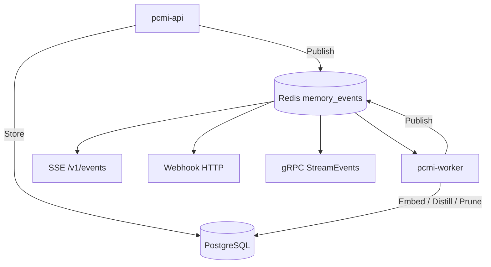
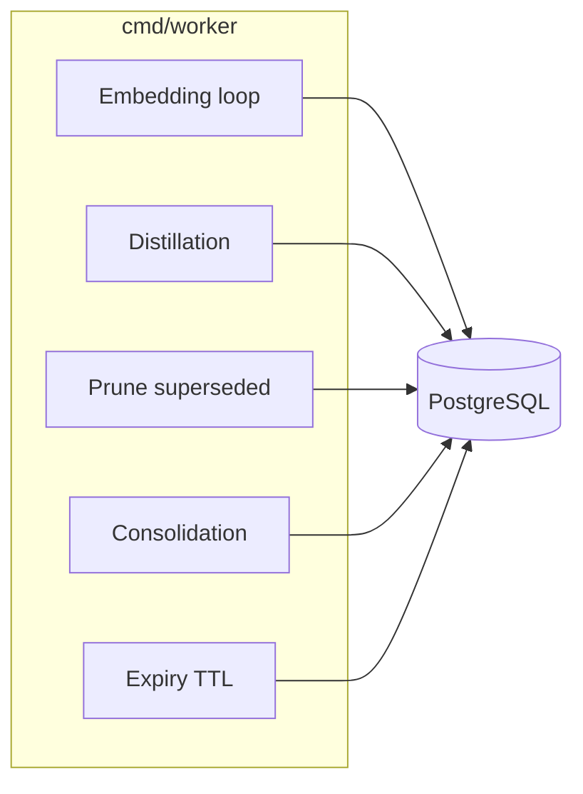

# Worker ed eventi

Come PCMI elabora memorie in background e notifica i client.

## Architettura eventi

## Tipi di evento (Redis / SSE)

| Tipo | Quando |
|------|--------|
| `memory.stored` | Prima versione di un path |
| `memory.updated` | Nuova versione (supersede) |
| `memory.refine.requested` | `POST /v1/memories/refine` o gRPC `Refine` |
| `knowledge.distilled` | Worker ha prodotto distillazione |

Schema payload: `GET /v1/events/schemas` o gRPC `ListEventSchemas`.

## Job worker

| Loop | Env / trigger | Effetto |
|------|----------------|---------|
| Embedding | `OPENAI_API_KEY`, `list_pending_embeddings` | Riempie `embedding` NULL |
| Distillation | Redis events, refine | `distilled_knowledge` |
| Pruning | `PRUNE_INTERVAL_SECS` | Rimuove versioni chiuse vecchie |
| Consolidation | eventi / soglia | Path `.consolidated` |
| Expiry | `EXPIRY_INTERVAL_SECS` | Chiude righe con `expires_at` passato |

Metriche worker: `GET :8081/metrics` (`pcmi_worker_redis_events_total`).

## Webhook

1. `POST /v1/webhooks` registra URL + `event_types` (+ `secret` opzionale).
2. Dispatcher API invia POST HTTP su match Redis.
3. Fallimenti → retry → `GET /v1/webhooks/dead-letter`.

gRPC: `RegisterWebhook`, `ListWebhooks`, `ListWebhookDeadLetter`.

### Firma HMAC-SHA256 (v1.39+)

Ogni delivery include:

| Header | Valore |
|--------|--------|
| `X-PCMI-Signature` | `sha256={hex(HMAC-SHA256(secret, timestamp + "." + body))}` |
| `X-PCMI-Timestamp` | Unix epoch (secondi, stringa decimale) |
| `X-PCMI-Delivery-ID` | UUID della riga `webhook_deliveries` |
| `X-PCMI-Event-Delivery` | `1` |
| `Content-Type` | `application/json` |

Verifica lato consumer (tolleranza default 5 minuti):

- Go: `crypto.HMACVerify(secret, signature, timestamp, body, time.Now(), crypto.DefaultWebhookMaxAge)`
- Python: `pcmi.webhook.verify_signature(secret, signature, timestamp, body)`
- TypeScript: `verifySignature(secret, signature, timestamp, body)` da `sdk/typescript/src/webhook.ts`

## Consumare eventi

| Modalità | Come |
|----------|------|
| SSE | `GET /v1/events` — SDK `subscribe()` |
| gRPC | `StreamEvents` — messaggi `StreamEventMsg` |
| Webhook | Endpoint tuo HTTPS |

Filtraggio: query `types=memory.stored,memory.updated` o campo `types` in `StreamEventsRequest`.
