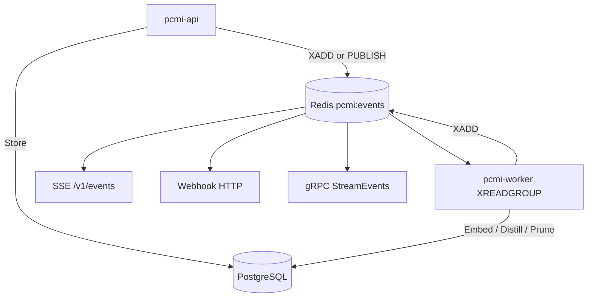
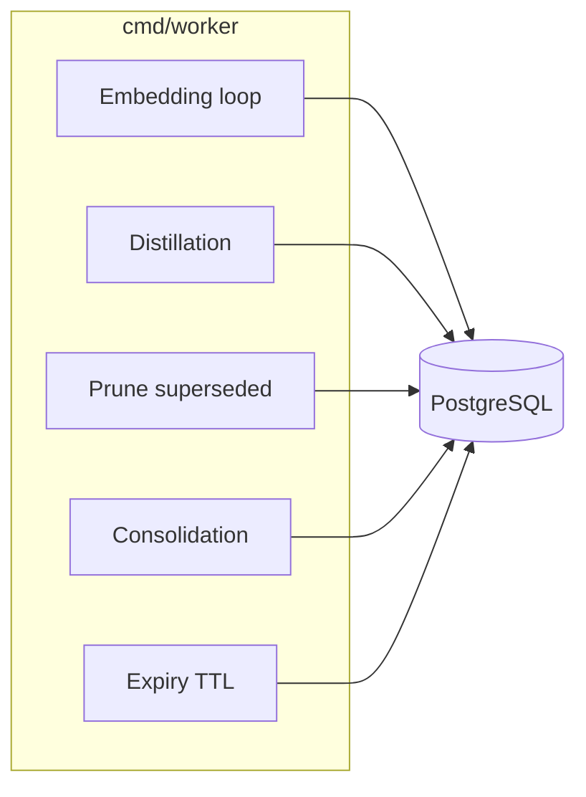

# Worker ed eventi

Come PCMI elabora memorie in background e notifica i client.

## Architettura eventi

Trasporto Redis configurabile con **`EVENT_BACKEND`** (default **`streams`**):

| Valore | Meccanismo | Note |
|--------|------------|------|
| `streams` | `XADD` su stream **`pcmi:events`**, consumer group **`pcmi-workers`** | Durable, at-least-once; DLQ `pcmi:events:dlq` dopo max tentativi |
| `pubsub` | Canale legacy **`memory_events`** | Compatibilità installazioni precedenti |

API e worker devono usare lo **stesso** backend. Test bus Streams senza Docker: `make test-streams-integration`.



## Tipi di evento (Redis / SSE)

| Tipo | Quando |
|------|--------|
| `memory.stored` | Prima versione di un path |
| `memory.updated` | Nuova versione (supersede) |
| `memory.refine.requested` | `POST /v1/memories/refine` o gRPC `Refine` |
| `knowledge.distilled` | Worker ha prodotto distillazione |

Schema payload: `GET /v1/events/schemas` o gRPC `ListEventSchemas`.

## Job worker



| Loop | Env / trigger | Effetto |
|------|----------------|---------|
| Embedding | `OPENAI_API_KEY`, `list_pending_embeddings` | Riempie `embedding` NULL; **circuit breaker** su provider OpenAI |
| Distillation | `LLM_PROVIDER` + chiave API, Redis events, refine | `distilled_knowledge` — vedi [Cambiare provider LLM](#cambiare-provider-llm) |
| Pruning | `PRUNE_INTERVAL_SECS` | Rimuove versioni chiuse vecchie |
| Consolidation | eventi / soglia | Path `.consolidated` |
| Expiry | `EXPIRY_INTERVAL_SECS` | Chiude righe con `expires_at` passato |

Metriche worker: `GET :8081/metrics` (`pcmi_worker_redis_events_total`).

### Cambiare provider LLM

Il worker di distillazione supporta quattro provider selezionabili tramite `LLM_PROVIDER` senza modificare il codice. Il default è `openai` per compatibilità con le installazioni esistenti.

| `LLM_PROVIDER` | Alias | Endpoint | Chiave API | Modello default |
|---|---|---|---|---|
| `openai` | — | api.openai.com | `OPENAI_API_KEY` | `gpt-4o-mini` |
| `grok` | `xai` | api.x.ai/v1 | `GROK_API_KEY` | `grok-3-mini` |
| `anthropic` | `claude` | api.anthropic.com/v1/messages | `ANTHROPIC_API_KEY` | `claude-haiku-4-5-20251001` |
| `deepseek` | — | api.deepseek.com/v1 | `DEEPSEEK_API_KEY` | `deepseek-chat` |

`DISTILLATION_MODEL` sovrascrive il modello default per qualsiasi provider.

**Esempio — passare a Claude:**

```env
LLM_PROVIDER=anthropic
ANTHROPIC_API_KEY=ant-...
# opzionale: forza un modello specifico
DISTILLATION_MODEL=claude-opus-4-7
```

**Esempio — Grok:**

```env
LLM_PROVIDER=grok
GROK_API_KEY=xai-...
```

**Esempio — DeepSeek:**

```env
LLM_PROVIDER=deepseek
DEEPSEEK_API_KEY=...
```

Se il provider è valido ma la chiave API è assente, il worker logga un avviso e salta la distillazione LLM (stessa semantica del precedente comportamento con `OPENAI_API_KEY` vuota). Se `LLM_PROVIDER` contiene un valore non supportato, il worker logga l'errore e ricade su un client OpenAI non configurato.

> **Nota Anthropic:** il formato API è diverso da OpenAI — il `system` prompt è un campo top-level, non un messaggio in array. L'adapter in `internal/worker/llm_anthropic.go` gestisce la traduzione trasparentemente. Non è richiesta nessuna dipendenza SDK aggiuntiva.

### Circuit breaker embedding (Sprint 1)

Tutti i provider da `internal/embedding/factory` sono wrappati con **`CircuitBreakerProvider`** (gobreaker + rate limit outbound). Se il circuito è **open**, il worker salta l’embedding senza bloccare il loop (fast-fail).

| Metrica | Significato |
|---------|-------------|
| `pcmi_embedding_circuit_state{state="open\|half_open\|closed"}` | Stato corrente (uno a 1) |
| `pcmi_embedding_requests_total{result="success\|error\|circuit_open"}` | Esiti chiamate |

Test: `make test-circuit-breaker`.

## Webhook

1. `POST /v1/webhooks` registra URL + `event_types` (+ `secret` opzionale).
2. Dispatcher API invia POST HTTP su match Redis.
3. Fallimenti → retry → `GET /v1/webhooks/dead-letter`.

gRPC: `RegisterWebhook`, `ListWebhooks`, `ListWebhookDeadLetter`.

### Firma HMAC-SHA256 (v1.39+)

Ogni delivery include:

| Header | Valore |
|--------|--------|
| `X-PCMI-Signature` | `sha256={hex(HMAC-SHA256(secret, timestamp + "." + body))}` |
| `X-PCMI-Timestamp` | Unix epoch (secondi, stringa decimale) |
| `X-PCMI-Delivery-ID` | UUID della riga `webhook_deliveries` |
| `X-PCMI-Event-Delivery` | `1` |
| `Content-Type` | `application/json` |

Verifica lato consumer (tolleranza default 5 minuti):

- Go: `crypto.HMACVerify(secret, signature, timestamp, body, time.Now(), crypto.DefaultWebhookMaxAge)`
- Python: `pcmi.webhook.verify_signature(secret, signature, timestamp, body)`
- TypeScript: `verifySignature(secret, signature, timestamp, body)` da `sdk/typescript/src/webhook.ts`

## Consumare eventi

| Modalità | Come |
|----------|------|
| SSE | `GET /v1/events` — SDK `subscribe()` |
| gRPC | `StreamEvents` — messaggi `StreamEventMsg` |
| Webhook | Endpoint tuo HTTPS |

Filtraggio: query `types=memory.stored,memory.updated` o campo `types` in `StreamEventsRequest`.
