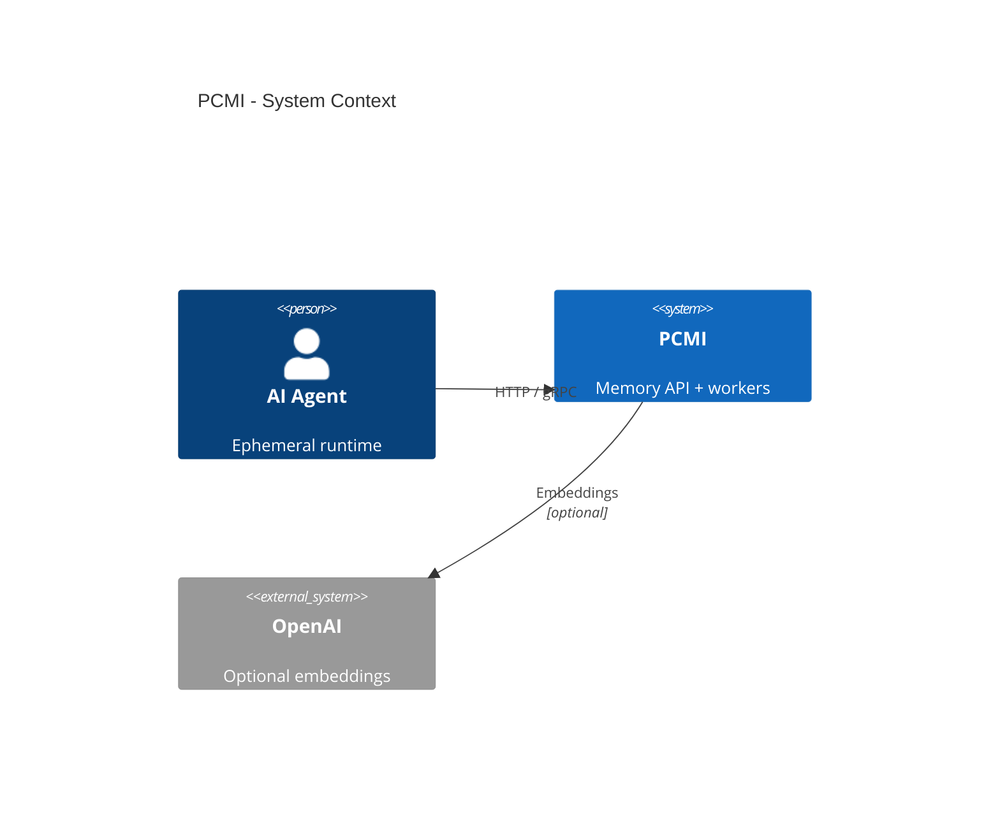
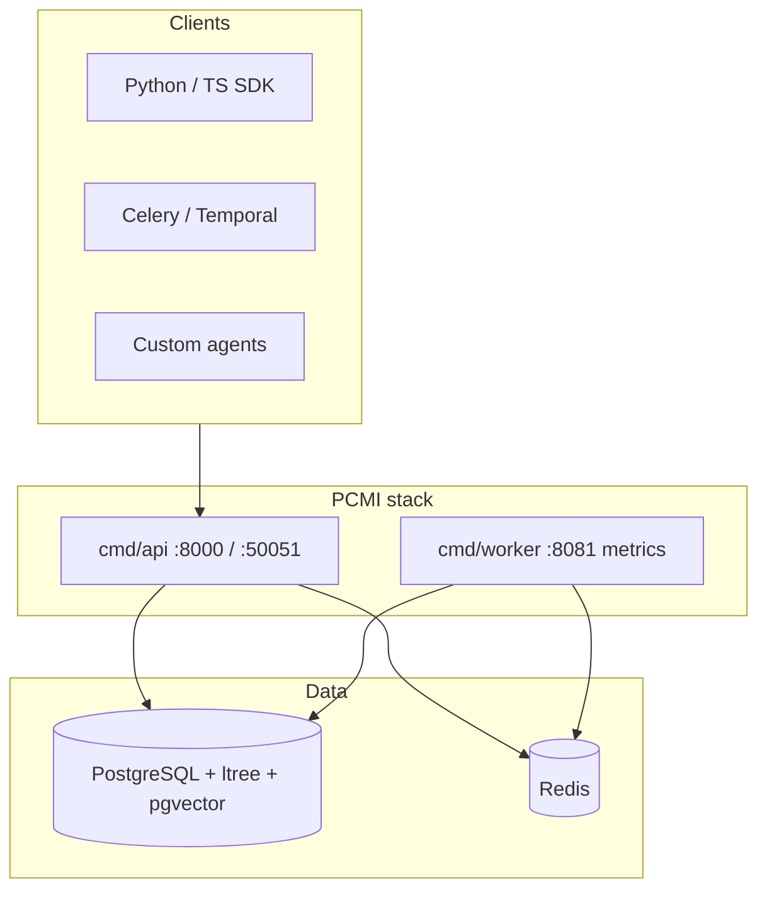
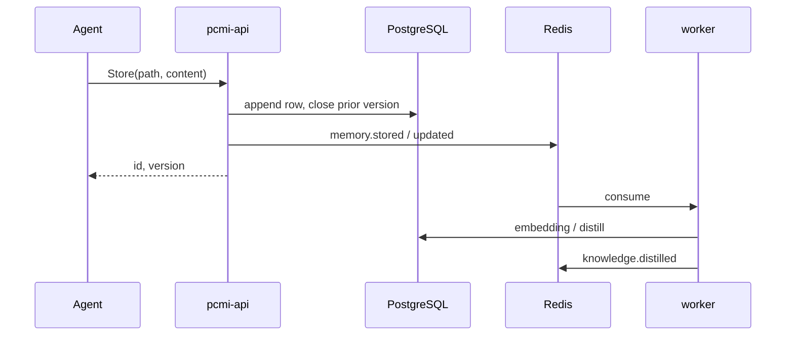
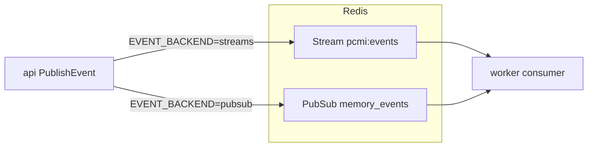

# PCMI Architecture

Persistent Cognitive Memory Infrastructure (PCMI) separates **ephemeral agents** from **durable memory**.

> **Agents are ephemeral. Memory is persistent.**

## System context

## Container view

## Principles

- **Runtime agnostic**: HTTP/gRPC; no framework lock-in in core.
- **Append-only cognition**: `valid_from` / `valid_to`; rollback = new row.
- **Hierarchical paths**: `ltree` scopes retrieval.
- **Hybrid retrieval**: prefix + BM25 + optional semantic (pgvector).
- **Event-driven workers**: Redis → embed, distill, prune, webhooks.

## Components

| Component | Role |
|-----------|------|
| `cmd/api` | Fiber REST, SSE, Prometheus `/metrics`, gRPC `MemoryService`, OTLP traces |
| `cmd/worker` | Embeddings, distillation, pruning, consolidation, expiry; `:8081/metrics` |
| PostgreSQL | Memories, distilled knowledge, links, audit, webhooks; RLS per tenant |
| Redis | Event bus: **Streams** `pcmi:events` (default) or pub/sub `memory_events` (`EVENT_BACKEND`) |
| SDKs | HTTP clients — see `sdk/` |

## Store flow

## API surfaces

| Surface | Port | Auth | Note |
|---------|------|------|------|
| HTTP REST | 8000 | `X-API-Key` | OpenAPI `docs/openapi.yaml` |
| gRPC | 50051 | `api_key` / metadata | `MemoryService`, `AdminService`, `MetricsService` |
| SSE events | 8000 | API key | `GET /v1/events` |
| Admin API | 8000 / 50051 | `admin` role | HTTP routes + gRPC `AdminService` |
| Admin UI | 8000 | `admin` role | `GET /v1/admin/ui` (browser, HTTP only) |
| Prometheus | 8000 | optional Bearer (`METRICS_SCRAPE_TOKEN`) | HTTP scrape or gRPC `MetricsService.Scrape` |

Full matrix: [grpc-vs-http.md](grpc-vs-http.md).

## Security

- RLS: `set_tenant_context(uuid)` per request.
- API keys: SHA-256 hash; roles `readonly`, `write`, `admin`.
- Optional encryption: `PCMI_ENCRYPTION_KEY`.

## Deployment

- **Local**: `docker compose up`
- **K8s**: `deploy/k8s/base/` + overlays — readiness `GET /v1/ready`, gRPC `Ready`
- **CI**: lint, unit, integration-smoke, SDK smoke, optional OpenAI E2E; runs on push/PR
- **Local full validation**: `make test-full-real` (see [local-ci.md](local-ci.md))

## Event bus (streams vs pub/sub)

## Related docs

- [USAGE.md](USAGE.md) — how to use PCMI
- [DATA-MODEL.md](DATA-MODEL.md) — schema and versioning
- [WORKERS-AND-EVENTS.md](WORKERS-AND-EVENTS.md) — background jobs
- [failure-modes.md](failure-modes.md), [scalability.md](scalability.md)
- [CODEBASE.md](CODEBASE.md), [MIGRATIONS.md](MIGRATIONS.md)
- [INDEX.md](INDEX.md) — full doc index
