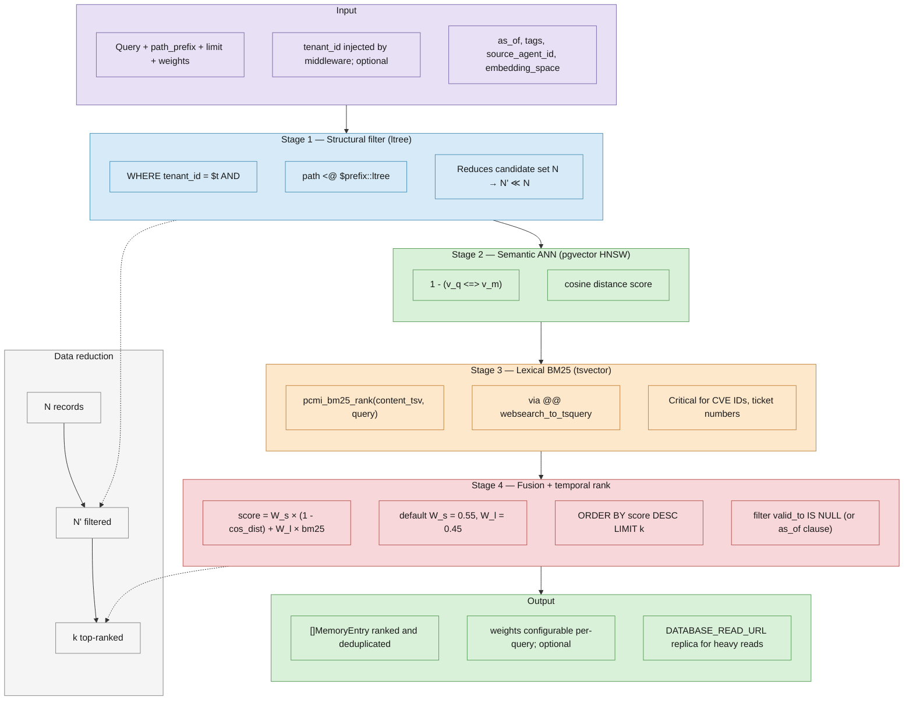

# Retrieval Pipeline

Hybrid retrieval in PCMI runs as a single SQL query in the repository layer (`internal/repository/memory_repository.go`), combining structural filtering, semantic ANN, lexical BM25, and weighted score fusion.

## Pipeline (Figure 7 — readable)

## Stages

| Stage | Mechanism | Role |
|-------|-----------|------|
| 1 | `ltree` prefix (`path <@ $prefix`) | Tenant-scoped structural filter; shrinks N → N' |
| 2 | pgvector HNSW ANN | Semantic similarity via cosine distance |
| 3 | `pcmi_bm25_rank` + `websearch_to_tsquery` | Lexical match for exact tokens (CVE IDs, tickets) |
| 4 | Weighted fusion + temporal clause | `0.55 × semantic + 0.45 × BM25`; `valid_to IS NULL` or `as_of` |

## Related

- Implementation: `internal/repository/memory_repository.go`, `internal/repository/retrieve_sql.go`
- Read replica: [federation-read-replicas.md](federation-read-replicas.md)
- Performance notes: [scalability.md](scalability.md)
