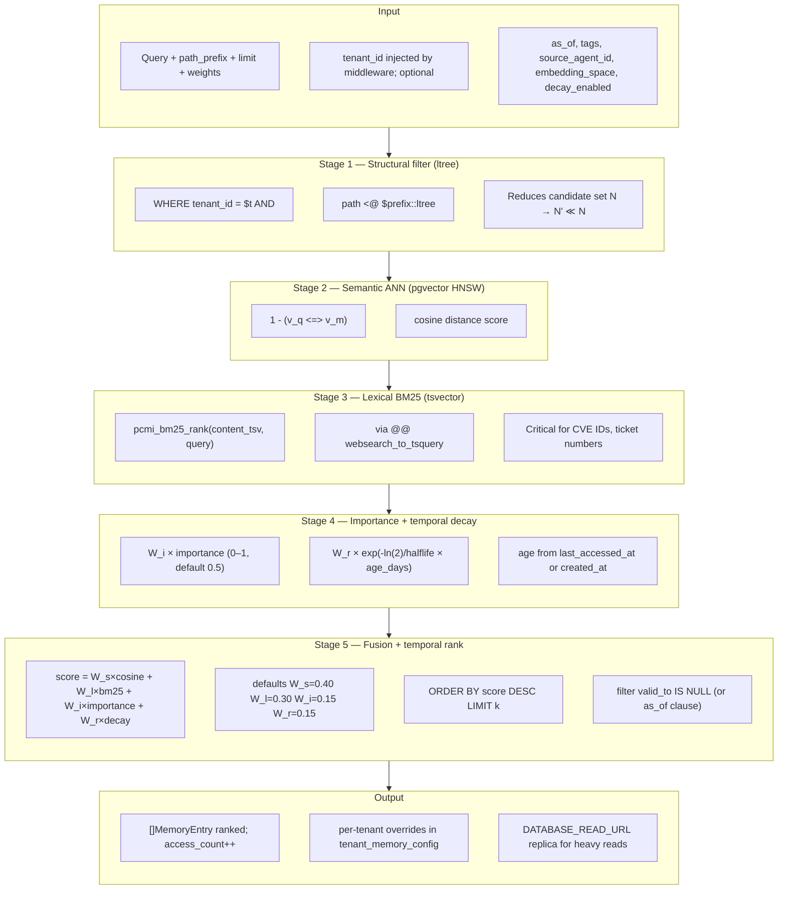

# Retrieval Pipeline

Hybrid retrieval in PCMI runs as a single SQL query in the repository layer (`internal/repository/memory_repository.go`), combining structural filtering, semantic ANN, lexical BM25, importance weighting, optional temporal decay, and weighted score fusion.

## Pipeline (Figure 7 — readable)



## Stages

| Stage | Mechanism | Role |
|-------|-----------|------|
| 1 | `ltree` prefix (`path <@ $prefix`) | Tenant-scoped structural filter; shrinks N → N' |
| 2 | pgvector HNSW ANN | Semantic similarity via cosine distance |
| 3 | `pcmi_bm25_rank` + `websearch_to_tsquery` | Lexical match for exact tokens (CVE IDs, tickets) |
| 4 | Importance + recency | Stored `importance`; decay from memory age (halflife days) |
| 5 | Weighted fusion + temporal clause | Four-term score; `valid_to IS NULL` or `as_of` |

## Score formula (v1.42+)

```
score = W_s × cosine + W_l × bm25 + W_i × importance + W_r × exp(-ln(2)/halflife × age_days)
```

- Default weights sum to **1.0** (`0.40 / 0.30 / 0.15 / 0.15`).
- Per-tenant overrides: table `tenant_memory_config`.
- `POST /v1/retrieve` with `"decay_enabled": false` omits the recency term (`W_r = 0`).
- `POST /v1/memories` accepts `"importance"` in `[0,1]` (default `0.5`).
- `PATCH /v1/memories/{path}/importance` updates the current row.
- Ranked retrieves increment `access_count` and `last_accessed_at`.

## Retrieve request fields

| JSON field | Effect |
|------------|--------|
| `importance` (on store) | Weight in fusion (0–1, default 0.5) |
| `decay_enabled` | `false` sets recency weight `W_r = 0` for this query |
| `weights` | Optional override of `W_s`, `W_l`, `W_i`, `W_r` (must sum to 1.0) |

After a ranked retrieve, matching rows get `access_count++` and `last_accessed_at` updated (feeds decay on later queries).

## Related

- Implementation: `internal/repository/memory_repository.go`, `internal/repository/retrieve_sql.go`
- Tests: `make test-retrieval-scoring`, `make bench-retrieval`
- Manual smoke (API up): `make smoke-importance` → `scripts/smoke_importance_retrieve.sh`
- Full local suite: `make test-full-real` includes this smoke in Phase 3
- Read replica: [federation-read-replicas.md](federation-read-replicas.md)
- Performance notes: [scalability.md](scalability.md)
