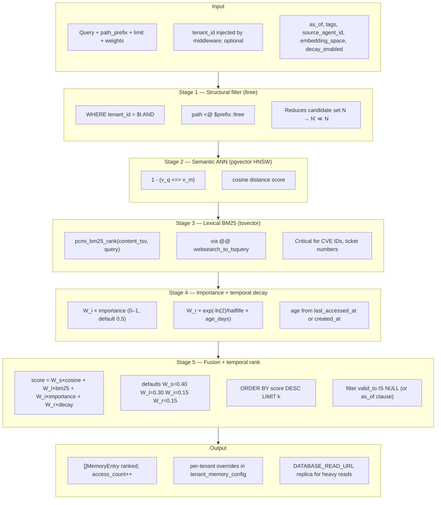

# Retrieval Pipeline

Hybrid retrieval in PCMI runs as a single SQL query in the repository layer (`internal/repository/memory_repository.go`), combining structural filtering, semantic ANN, lexical BM25, importance weighting, optional temporal decay, and weighted score fusion.

## Pipeline (Figure 7 — readable)


```mermaid
flowchart TB
  subgraph INPUT["Input"]
    direction TB
    I1["Query + path_prefix + limit + weights"]
    I2["tenant_id injected by middleware; optional"]
    I3["as_of, tags, source_agent_id, embedding_space, decay_enabled"]
  end

  subgraph S1["Stage 1 — Structural filter (ltree)"]
    direction TB
    S1A["WHERE tenant_id = $t AND"]
    S1B["path &lt;@ $prefix::ltree"]
    S1C["Reduces candidate set N → N' ≪ N"]
  end

  subgraph S2["Stage 2 — Semantic ANN (pgvector HNSW)"]
    direction TB
    S2A["1 - (v_q &lt;=&gt; v_m)"]
    S2B["cosine distance score"]
  end

  subgraph S3["Stage 3 — Lexical BM25 (tsvector)"]
    direction TB
    S3A["pcmi_bm25_rank(content_tsv, query)"]
    S3B["via @@ websearch_to_tsquery"]
    S3C["Critical for CVE IDs, ticket numbers"]
  end

  subgraph S4["Stage 4 — Importance + temporal decay"]
    direction TB
    S4I["W_i × importance (0–1, default 0.5)"]
    S4R["W_r × exp(-ln(2)/halflife × age_days)"]
    S4D["age from last_accessed_at or created_at"]
  end

  subgraph S5["Stage 5 — Fusion + temporal rank"]
    direction TB
    S5A["score = W_s×cosine + W_l×bm25 + W_i×importance + W_r×decay"]
    S5B["defaults W_s=0.40 W_l=0.30 W_i=0.15 W_r=0.15"]
    S5C["ORDER BY score DESC LIMIT k"]
    S5D["filter valid_to IS NULL (or as_of clause)"]
  end

  subgraph OUTPUT["Output"]
    direction TB
    O1["[]MemoryEntry ranked; access_count++"]
    O2["per-tenant overrides in tenant_memory_config"]
    O3["DATABASE_READ_URL replica for heavy reads"]
  end

  INPUT --> S1
  S1 --> S2
  S2 --> S3
  S3 --> S4
  S4 --> S5
  S5 --> OUTPUT
```

## Stages

| Stage | Mechanism | Role |
|-------|-----------|------|
| 1 | `ltree` prefix (`path <@ $prefix`) | Tenant-scoped structural filter; shrinks N → N' |
| 2 | pgvector HNSW ANN | Semantic similarity via cosine distance |
| 3 | `pcmi_bm25_rank` + `websearch_to_tsquery` | Lexical match for exact tokens (CVE IDs, tickets) |
| 4 | Importance + recency | Stored `importance`; decay from memory age (halflife days) |
| 5 | Weighted fusion + temporal clause | Four-term score; `valid_to IS NULL` or `as_of` |

## Score formula (v1.42+)

```
score = W_s × cosine + W_l × bm25 + W_i × importance + W_r × exp(-ln(2)/halflife × age_days)
```

- Default weights sum to **1.0** (`0.40 / 0.30 / 0.15 / 0.15`).
- Per-tenant overrides: table `tenant_memory_config`.
- `POST /v1/retrieve` with `"decay_enabled": false` omits the recency term (`W_r = 0`).
- `POST /v1/memories` accepts `"importance"` in `[0,1]` (default `0.5`).
- `PATCH /v1/memories/{path}/importance` updates the current row.
- Ranked retrieves increment `access_count` and `last_accessed_at`.

## Retrieve request fields

| JSON field | Effect |
|------------|--------|
| `importance` (on store) | Weight in fusion (0–1, default 0.5) |
| `decay_enabled` | `false` sets recency weight `W_r = 0` for this query |
| `weights` | Optional override of `W_s`, `W_l`, `W_i`, `W_r` (must sum to 1.0) |
| `rerank` | `false` opts out of [LLM reranking](#optional-llm-reranking) for this query |

After a ranked retrieve, matching rows get `access_count++` and `last_accessed_at` updated (feeds decay on later queries).

## Optional LLM reranking

With `RERANK_ENABLED=true`, a query retrieve (non-empty `query`, first page) runs one more stage after fusion:

1. Fetch the top `RERANK_CANDIDATES` (default 20, max 50) rows by hybrid score instead of `limit`.
2. Send the query and a whitespace-collapsed, 600-byte snippet of each candidate (`[i] (path) text`) to the `LLM_PROVIDER` client (model `RERANK_MODEL`, else `DISTILLATION_MODEL`); the prompt tells the model to treat snippets as data and return `{"ranking": [...]}`.
3. Reorder by that ranking (indices the model omits keep their hybrid order at the end) and truncate to `limit`. The response carries `"reranked": true`.

Reranking can only reorder rows the tenant was already allowed to see; it never adds rows. Each call is bounded by `RERANK_TIMEOUT_MS` (default 4000) and guarded by a circuit breaker (5 consecutive failures → 30 s open). On timeout, error, open breaker, or an unparseable answer, the response falls back to the hybrid order (`reranked` absent) — retrieval never fails because of the reranker. Path-only retrieves and cursor pages are never reranked.

| Knob | Default | Effect |
|------|---------|--------|
| `RERANK_ENABLED` | `false` | Enable server-wide; requests opt out with `"rerank": false` |
| `RERANK_CANDIDATES` | `20` | Candidate pool (1–50) |
| `RERANK_MODEL` | `DISTILLATION_MODEL` | Model for the rerank call |
| `RERANK_TIMEOUT_MS` | `4000` | Per-call timeout |

**Data flow and cost.** Enabling reranking sends retrieved memory text to the configured LLM provider, like distillation does; do not enable it for tenants whose data must stay in-VPC unless `LLM_PROVIDER` / `OPENAI_BASE_URL` points at a self-hosted model. Every rerank call is metered as operation `rerank` in [usage metering](USAGE.md#usage-metering-finops). Metric: `pcmi_rerank_total{outcome="reranked"|"fallback"}`.

**Measuring it.** Compare the eval harness with and without reranking on the same server:

```bash
RERANK_ENABLED=true go run ./cmd/api &   # plus worker, with an LLM key
python3 eval/retrieval/run_eval.py --rerank off --report baseline.json
python3 eval/retrieval/run_eval.py --rerank server --report reranked.json
```

gRPC `Retrieve` follows the server setting (the proto has no per-request opt-out yet).

## Related

- Implementation: `internal/repository/memory_repository.go`, `internal/repository/retrieve_sql.go`
- Tests: `make test-retrieval-scoring`, `make bench-retrieval`
- Manual smoke (API up): `make smoke-importance` → `scripts/smoke_importance_retrieve.sh`
- Full local suite: `make test-full-real` includes this smoke in Phase 3
- Read replica: [federation-read-replicas.md](federation-read-replicas.md)
- Performance notes: [scalability.md](scalability.md)
